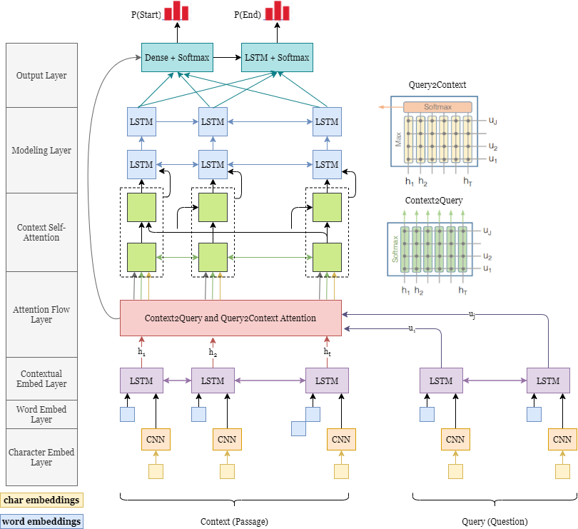

This repository is part of the [CS 224N](http://web.stanford.edu/class/cs224n/project/default-final-project-handout-squad-track.pdf) Winter 2021 Default final project. Our model is a modification of the BiDAF model (described in [Seo et al.](https://arxiv.org/abs/1611.01603). We add an additional gated self-attention layer, as described in the Microsoft Research Asia's paper [R-NET: Machine Reading Comprehension with Self-matching Networks](https://www.microsoft.com/en-us/research/wp-content/uploads/2017/05/r-net.pdf). An illustration of the model architecture is as follows:

With this model, we obtain competitive results on the CS 224N IID-SQuAD Leaderboard:
On dev set, EM: 62.342, F1: 65.540, compared to the baseline BiDAF model's EM: 57.889, and F1: 60.965.
On test set, rank 34 in total. 

To run the code, follow the instructions below: (copied from CS 224N starter code README)

1. Make sure you have [Miniconda](https://conda.io/docs/user-guide/install/index.html#regular-installation) installed
    1. Conda is a package manager that sandboxes your project’s dependencies in a virtual environment
    2. Miniconda contains Conda and its dependencies with no extra packages by default (as opposed to Anaconda, which installs some extra packages)

2. cd into src, run `conda env create -f environment.yml`
    1. This creates a Conda environment called `squad`

3. Run `conda activate squad`
    1. This activates the `squad` environment
    2. Do this each time you want to write/test your code
  
4. Run `python setup.py`
    1. This downloads SQuAD 2.0 training and dev sets, as well as the GloVe 300-dimensional word vectors (840B)
    2. This also pre-processes the dataset for efficient data loading
    3. For a MacBook Pro on the Stanford network, `setup.py` takes around 30 minutes total  

5. Browse the code in `train.py`
    1. The `train.py` script is the entry point for training a model. It reads command-line arguments, loads the SQuAD dataset, and trains a model.
    2. You may find it helpful to browse the arguments provided by the starter code. Either look directly at the `parser.add_argument` lines in the source code, or run `python train.py -h`.
